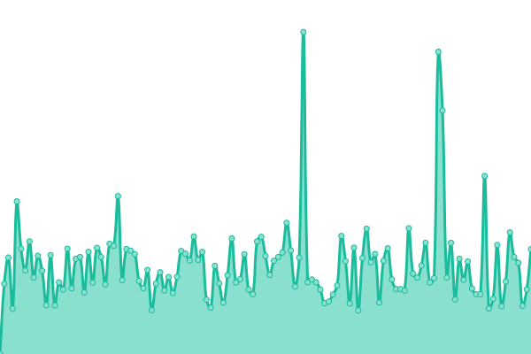

# [📈 Live Status](https://sgidevnet.github.io/statuspage): <!--live status--> **🟩 All systems operational**

This repository contains the open-source uptime monitor and status page for [Silicon Graphics User Group / SGIdev](https://sgi.sh), powered by [Upptime](https://github.com/upptime/upptime).

With [Upptime](https://upptime.js.org), you can get your own unlimited and free uptime monitor and status page, powered entirely by a GitHub repository. We use [Issues](https://github.com/sgidevnet/statuspage/issues) as incident reports, [Actions](https://github.com/sgidevnet/statuspage/actions) as uptime monitors, and [Pages](https://sgidevnet.github.io/statuspage) for the status page.

<!--start: status pages-->
<!-- This summary is generated by Upptime (https://github.com/upptime/upptime) -->
<!-- Do not edit this manually, your changes will be overwritten -->
<!-- prettier-ignore -->
| URL | Status | History | Response Time | Uptime |
| --- | ------ | ------- | ------------- | ------ |
|  [SGUG Forums](https://forums.sgi.sh) | 🟩 Up | [sgug-forums.yml](https://github.com/sgidevnet/statuspage/commits/HEAD/history/sgug-forums.yml) | 

 634ms
     
 | 

<a href="https://status.sgi.sh/history/sgug-forums">100.00%</a>
    

|  [RSE Yum Repository (0.0.7)](https://ports.sgi.sh/repo/0.0.7/repodata/repomd.xml) | 🟩 Up | [rse-yum-repository-0-0-7.yml](https://github.com/sgidevnet/statuspage/commits/HEAD/history/rse-yum-repository-0-0-7.yml) | 

 625ms
     
 | 

<a href="https://status.sgi.sh/history/rse-yum-repository-0-0-7">100.00%</a>
    

|  [RSE Yum Repository (0.0.5)](https://ports.sgi.sh/repo/0.0.5/repodata/repomd.xml) | 🟩 Up | [rse-yum-repository-0-0-5.yml](https://github.com/sgidevnet/statuspage/commits/HEAD/history/rse-yum-repository-0-0-5.yml) | 

 304ms
     
 | 

<a href="https://status.sgi.sh/history/rse-yum-repository-0-0-5">100.00%</a>
    

<!--end: status pages-->

[**Visit our status website →**](https://sgidevnet.github.io/statuspage)

## 📄 License

- Powered by: [Upptime](https://github.com/upptime/upptime)
- Code: [MIT](./LICENSE) © [Anand Chowdhary](https://anandchowdhary.com), supported by [Pabio](https://pabio.com)
- Data in the `./history` directory: [Open Database License](https://opendatacommons.org/licenses/odbl/1-0/)
